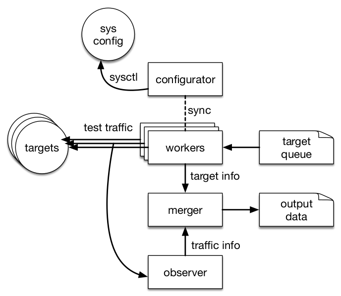

Introduction
============

Network operators increasingly rely on in-network functionality to make their
networks manageable and economically viable. These middleboxes make the
end-to-end path for traffic more opaque by making assumptions about the traffic
passing through them. This has led to an ossification of the Internet protocol
stack: new protocols and extensions can be difficult to deploy when middleboxes
do not understand them [Honda11]_. PATHspider is a software measurement tool
for active measurement of Internet path transparency to transport protocols and
transport protocol extensions, that can generate raw data at scale to determine
the size and shape of this problem.

The A/B testing measurement methodology used by PATHspider is simple: We
perform connections from a set of observation points to a set of measurement
targets using two configurations. A baseline configuration (A), usually a TCP
connection using kernel default and no extensions, tests basic connectivity.
These connections are compared to the experimental configuration (B), which
uses a different transport protocol or set of TCP extensions. These connections
are made as simultaneously as possible, to reduce the impact of transient
network changes.

Since PATHspider 2.0, it is also possible to perform more than one B test
optionally performing an A test between each B test in order to revalidate the
path. This can also be used to "prime" the path for a follow up connection if
it is desirable to have devices on the path hold state before performing the
test.

PATHspider is a generalized version of the
`ecnspider <https://github.com/britram/pathtools/tree/master/pathspider/ecnspider2>`_
tool, used in previous studies to probe the paths from multiple vantage points
to web-servers [Trammell15]_ and to peer-to-peer clients [Gubser15]_ for
failures negotiating Explicit Congestion Notification (ECN) [RFC3168]_ in
TCP.

As a generalized tool for controlled experimental A/B testing of path
impairment, PATHspider fills a gap in the existing Internet active
measurement software ecosystem.  Existing active measurement platforms, such
as RIPE Atlas [RIPEAtlas]_, OONI [Filasto12]_, or
Netalyzr [Kreibich10]_, were built to measure absolute performance and
connectivity between a pair of endpoints under certain conditions. The results
obtainable from each of these can of course be compared to each other to
simulate A/B testing. However, the measurement data obtained from these
platforms provide a less controlled view than can be achieved with
PATHspider, given coarser scheduling of measurements in each state.

Given PATHspider's modular design and implementation in Python, plugins to
perform measurements for any transport protocol or extension are easy to
build and can take advantage of the rich Python library ecosystem, including
high-level application libraries, low-level socket interfaces, and packet
forging tools such as `Scapy <http://www.secdev.org/projects/scapy/>`_.

.. architecture:

Architecture
------------

The PATHspider architecture has four components, illustrated in
the diagram below the :func:`configurator
<pathspider.base.Spider.configurator>`, the :func:`workers
<pathspider.sync.SynchronizedSpider.worker>`, the :class:`observer
<pathspider.observer.Observer>` and the :func:`combiner
<pathspider.base.Spider.combine_flows>`. Each component is implemented as one or more
threads, launched when PATHspider starts.

.. figarch:

   An overview of the PATHspider architecture

For each target hostname and/or address, with port numbers where appropriate,
PATHspider enqueues a job, to be distributed amongst the worker threads when
available.  Each worker performs one connection with the "A" configuration
and one connection with the "B" configuration. The "A" configuration will
always be connected first and serves as the base line measurement, followed by
the "B" configuration. This allows detection of hosts that do not respond
rather than failing as a result of using a particular transport protocol or
extension. These sockets remain open for a post-connection operation.

Some transport options require a system-wide parameter change, for example
enabling ECN in the Linux kernel.  This requires locking and synchronisation.
Using semaphores, the configurator waits for each worker to complete an
operation and then changes the state to perform the next batch of operations.
This process cycles continually until no more jobs remain.

In a typical experiment, multiple workers (on the order of hundreds) are
active, since much of the time in a connection test is spent waiting for an
answer from the target or a timeout to fire. Where it is possible to peform the
tests without a system-wide configuration it is possible to disable the
semaphores to increase the speed of the test.

In addition, packets are separately captured for analysis by the observer using
`Python bindings for libtrace
<https://www.cs.auckland.ac.nz/~nevil/python-libtrace/>`_. First, the observer
assigns each incoming packet to a flow based on the source and destination
addresses, as well as the TCP, UDP or SCTP ports when available. The packet and
its associated flow are then passed to a function chain. The functions in this
chain may be simple functions, such as counting the number of packets or octets
seen for a flow, or more complex functions, such as recording the state of
flags within packets and analysis based on previously observed packets in the
flow. For example, a function may record both an ECN negotiation attempt and
whether the host successfully negotiated use of ECN.

A function may alert the observer that a flow should have completed and that
the flow information can be matched with the corresponding job record and
passed to the merger. The merger extracts the fields needed for a particular
measurement campaign from the records produced by the worker and the observer.

Extensibility
-------------

PATHspider plugins are built by extending an abstract class that
implements the core behaviour, with functions for the
configurator, workers, observer, and merger. There are three main abstract
classes that can be extended by plugins:
:class:`pathspider.sync.SynchronizedSpider`,
:class:`pathspider.desync.DesynchronizedSpider` and
:class:`pathspider.forge.ForgeSpider`.

Depending on the type of plugin being created, these abstract classes are
extended to include logic for generating the active measurement traffic.

Plugins can implement arbitrary functions for the observer function chain, or
reuse library functions for some functionality.  These track the state of flows
and build flow records for different packet classes: The first chain handles
setup on the first packet of a new flow.  Separate chains chains for IP, TCP
and UDP packets to allow different behaviours based on the IP version and
transport protocol.

The final plugin function is the combiner function. This takes
a list of merged job records and flow records to produce "path conditions"
before passing the final job record back to PATHspider for output.
