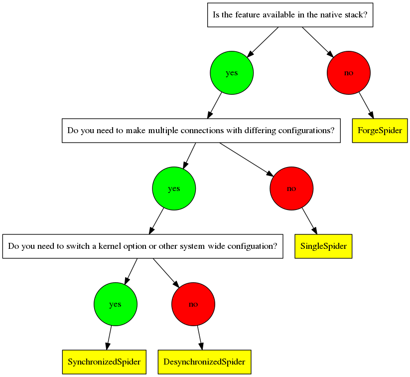

Choosing a Plugin Model
=======================

To be as flexible as possible while using real network stacks, PATHspider has 4
models for plugins. The following flowchart can help you to decide which model
best suits your use case:

   A flowchart to help choosing a model for your plugin

SynchronizedSpider Model
------------------------

This is the original model, where connection logic is built-in to PATHspider and
the plugin provides functions for altering the system-wide configuration.
Originally developed for testing with explicit congestion notification, this
model can be used wherever iptables rules, sysctl flags or other system-wide
configuration changes can be used to enable or disable a particular feature
of a network protocol.

DesynchronizedSpider Model
--------------------------

This model was developed for TCP fast open where synchronization was not
required. In this case, socket options are used to control whether or not the
feature is used and so the global synchronization only serves to slow down
measurements. The connection helper you are using must support the feature
which means for most helpers that it must be supported by both libcurl and
pycurl.

SingleSpider Model
------------------

This model was developed for TCP Maximum Segment Size discovery. In this case,
only a single connection is required with no global configuration or
customisation of the connection. All work is done by the Observer or using the
output of the connection helpers.

ForgeSpider Model
-----------------

This model was developed for evil bit testing where there was no support in the
native stack. It uses Scapy to forge packets and so is the most flexible, but
care must be taken to ensure that the baseline test is truly representative of
existing traffic on the Internet. As an example, some firewall drop TCP packets
that do not use timestamps as a "defense" against forged packets.

